# 100 Days and 40 Projects of RxSwift
Similar with [samvlu's 100-days-of-swift](http://samvlu.com/index.html), but refactor by RxSwift.

**Project 1-19**
- Apple Swift version 2.2 (swiftlang-703.0.18.1 clang-703.0.29)
- Xcode 7.3
- iOS 9.3
- Simulator iPhone 6s 
- RxSwift 2.5

**Project 20-40**
- Apple Swift version 3.0 (swiftlang-800.0.46.2 clang-800.0.38)
- Xcode Version 8.0 (8A218a)
- iOS 10.0
- Simulator iPhone 7
- RxSwift 3.0

## PROJECT 22 - SETTING THE DATE
##### 2016-11-11
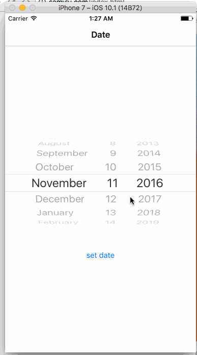

What I Learned:

- How to format date from DatePicker

## PROJECT 21 - Set Location
##### 2016-10-17 
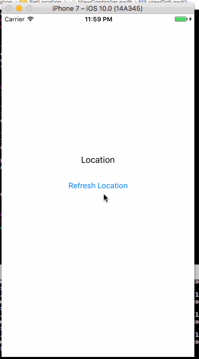

What I Learned:

- Get current location with RxSwift

## PROJECT 20 - Save Date Location Photo
##### 2016-10-13
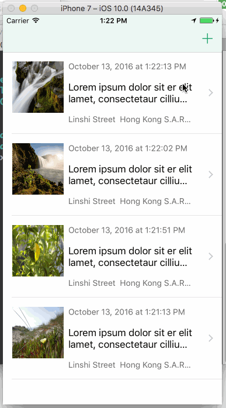

What I Learned:

- UITableView simple data source with RxSwift
- Get current location with RxSwift
- Get image with RxSwift

Tools: Xcode

## PROJECT 19 - BUTTONS ABOVE KEYBOARD
##### 2016-05-14
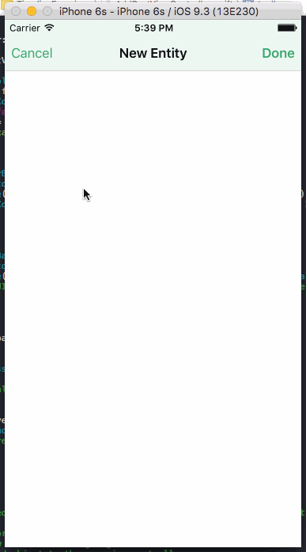

What I Learned:

- Create an Accessory Input View
- Use icons for UIButtons

Tools: Sketch, Xcode, Vim

## PROJECT 18 - DYNAMIC DATA FOR EACH CELL
##### 2016-05-13
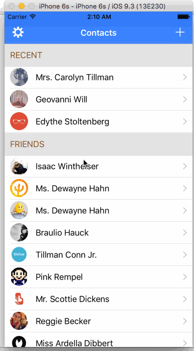

##### Part 4 of Contacts App for iOS

What I Learned:

- Load data with RxSwift
- Push ViewController with rx_selected
- How to show multiline in UILable

Tools: Sketch, Xcode, Vim

## PROJECT 17 - THE MODEL AND CONTROLLERS
##### 2016-05-13
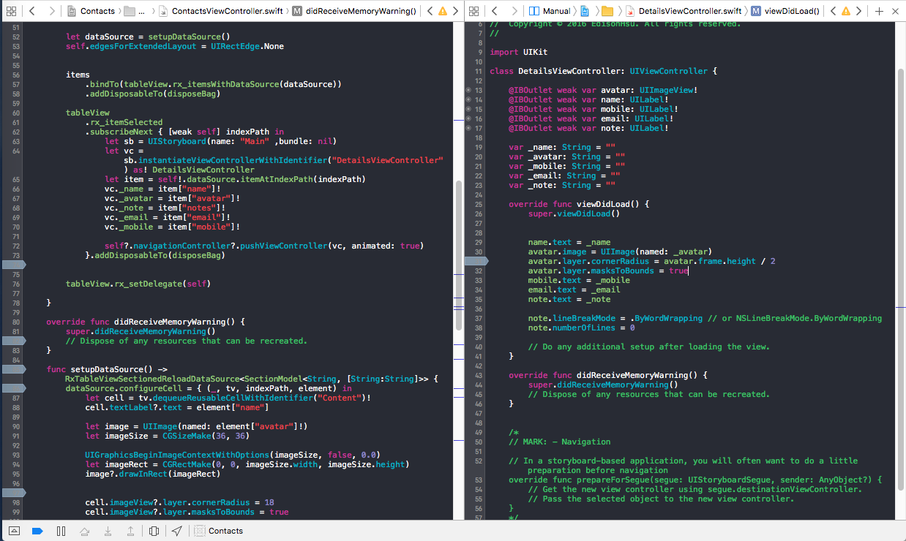

##### Part 3 of Contacts App for iOS

What I Learned:

- Store and access data in Json File
- Create Section Headers and Rows in Tables

Tools: Sketch, Xcode, Vim

## PROJECT 16 - BUILDING THE USER INTERFACE
##### 2016-05-08
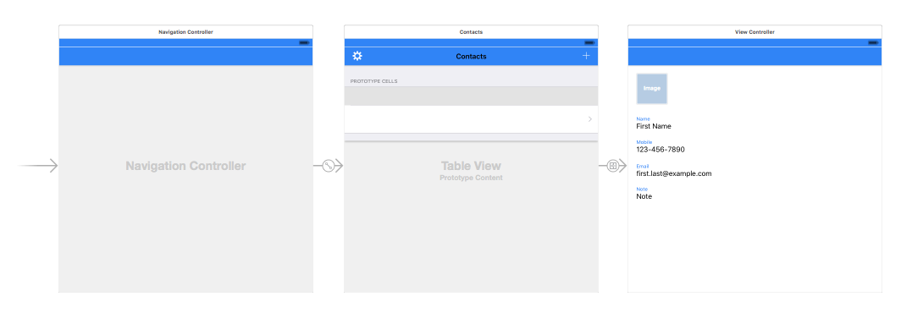

##### Part 2 of Contacts App for iOS

What I Learned:

- Use Navigation, Table View and View Controllers
- Use Auto Layout for creating Universal Apps

Tools: Sketch, Xcode, Vim

## PROJECT 15 - FROM SKETCH TO XCODE
##### 2016-05-07
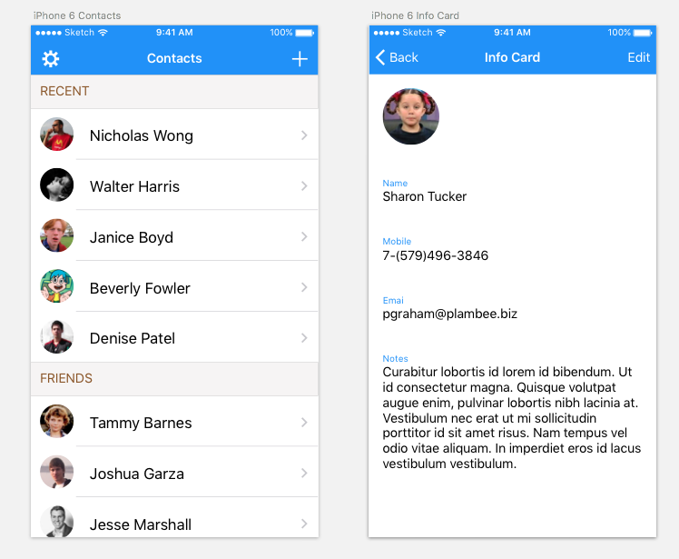

##### Part 1 of Contacts App for iOS

What I Learned:

- How to use Sketch

Tools: Sketch, Xcode, Vim

Sketch is a very awesome design tool. I just use few time to finish the task and it's very easy to export assets.

## PROJECT 14 - JUMPBAR
##### 2016-05-07
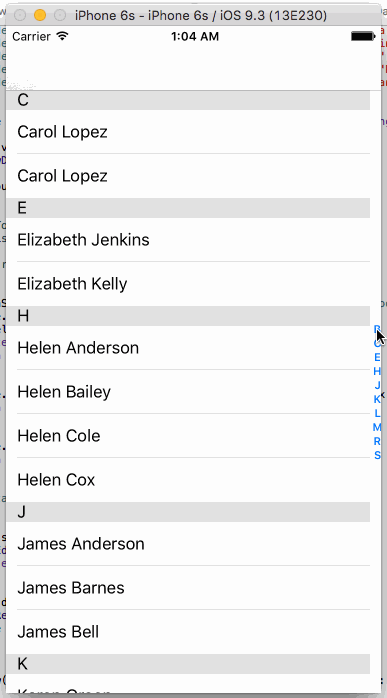

What I Learned:

- How to config dataSource in RxSwift
- Learn Create an Indexed Table View 

## PROJECT 13 - STICKY SECTION HEADERS
##### 2016-05-02
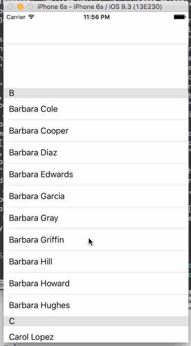

What I Learned:

- How to build sticky section tableview
- How to use RxTableViewSectionedReloadDataSource in RxSwift

## PROJECT 12 - ADD NEW ITEM
##### 2016-04-30
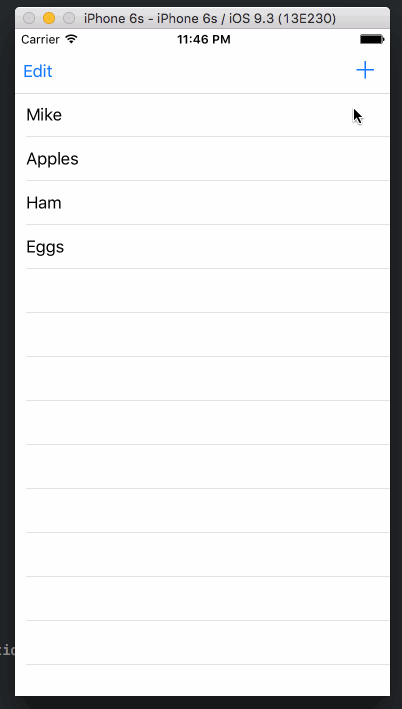

What I Learned:

- How to show keyboard when view appear
- How to pass data back to view controller

## PROJECT 11 - DELETING AND REARRANGING
##### 2016-04-28
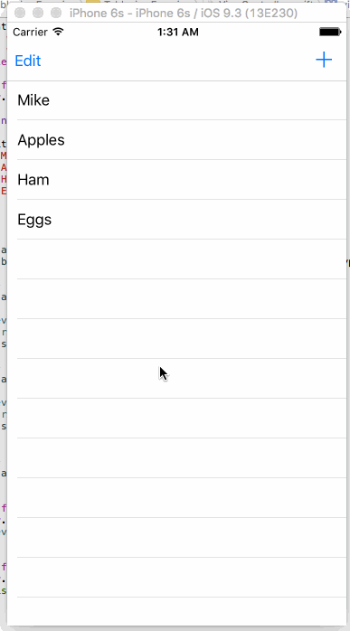

What I Learned:

- How to use rx_itemMoved in RxSwift
- How to use rx_itemDeleted in RxSwift
- Learn what is editButtonItem in UITableView

## PROJECT 10 - PULL TO REFRESH TABLE VIEW
##### 2016-04-16
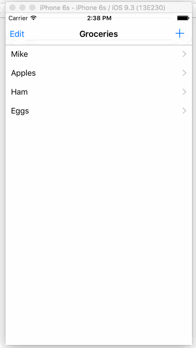

What I Learned:

- How to use TableView binding in RxSwift
- Learn what is Variable in RxSwift
- Hot to refresh data in RxSwift

## PROJECT 9 - ADD PHOTO FROM CAMERA ROLL
##### 2016-04-16

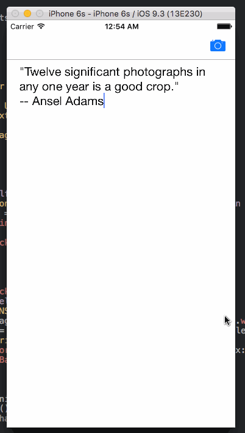

What I Learned:

- How to use UIImagePickerController in RxSwift
- Control how the image is displayed to prevent stretching

## PROJECT 8 - SWIPE DOWN TO DISMISS KEYBOARD
##### 2016-04-11

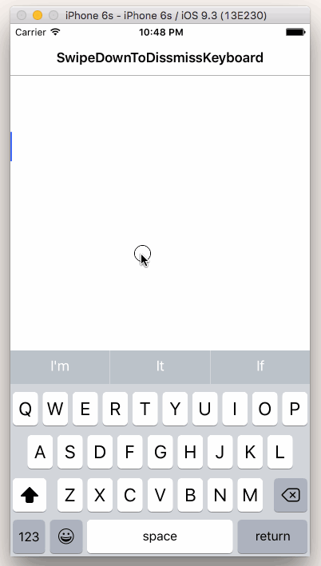

What I Learned:

- How to use UISwipeGestureRecognizer in RxSwift
- Auto-launch the Keyboard when the View loads

## PROJECT 7 - PASSING DATA TO ANOTHER VIEW
##### 2016-04-09

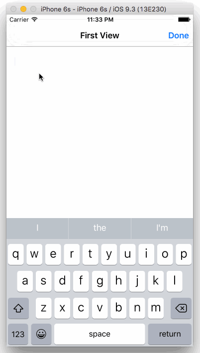

What I Learned:

- How to send data through segue

## PROJECT 6 - GETTING CURRENT DATE AND TIME
##### 2016-04-08

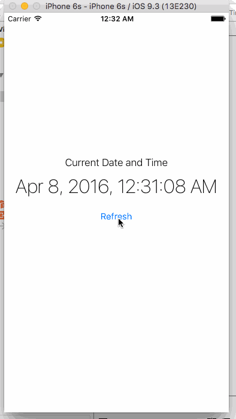

What I Learned:

- How to work with RxSwift#BindTo
- Hot to use NSDateFormatter with build in dateStyle and timeStyle

## PROJECT 5 - BASIC TABLE VIEW
##### 2016-04-06

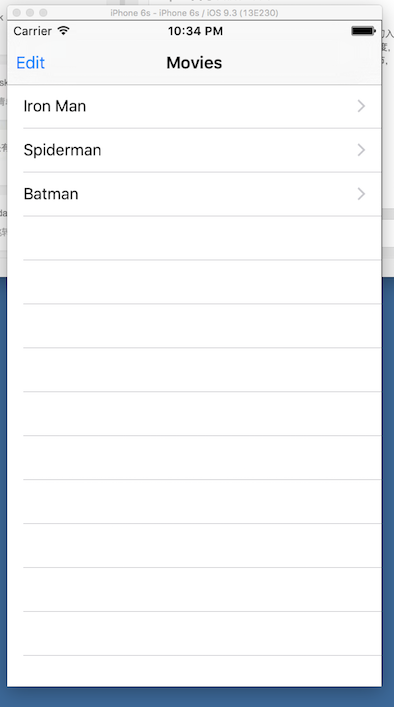

What I Learned:

- Build Custom Table View Controller
- Work with Nav Bar Buttons
- Populate Table Rows with local data

## PROJECT 4 - Tip Calculator
##### 2016-04-03

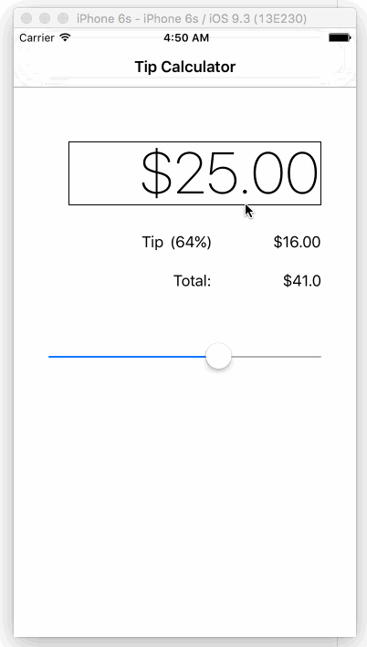

What I Learned:

- How to use UISlider in RxSwift
- Create a toolbar above the keyboard

## PROJECT 3 - Swift iAd
##### 2016-04-02

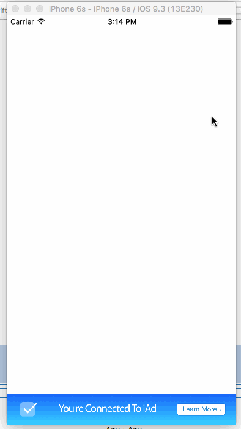

What I Learned:

- Hot to add iAd banner by using Swift

## PROJECT 2 - Tap Or Hold Counter
##### 2016-03-30

What I Learned:

- Hot to use UILongGestureRecognizer in RxSwift

## PROJECT 1 - Tap Counter
##### 2016-03-27

What I Learned:

- Hot to use UIButton#rx_tap
- How to use RxSwift#DisposeBag
- Custom Navigation item

