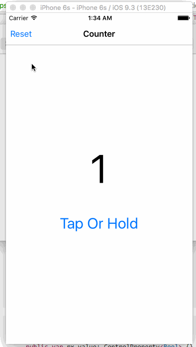
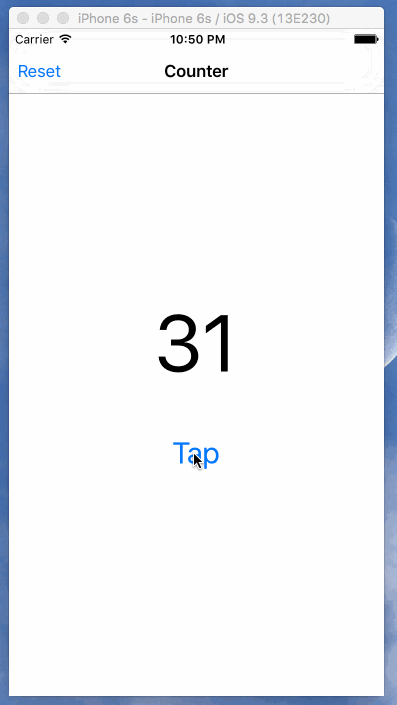

# 100 Days and 40 Projects of RxSwift
- Swift 2.1
- Xcode 7.3

## PROJECT 2 - Tap Or Hold Counter
##### 2016-03-30

What I Learned:

- Hot to use UILongGestureRecognizer in RxSwift

## PROJECT 1 - Tap Counter
##### 2016-03-27

What I Learned:

- Hot to use UIButton#rx_tap
- How to use RxSwift#DisposeBag
- Custom Navigation item
